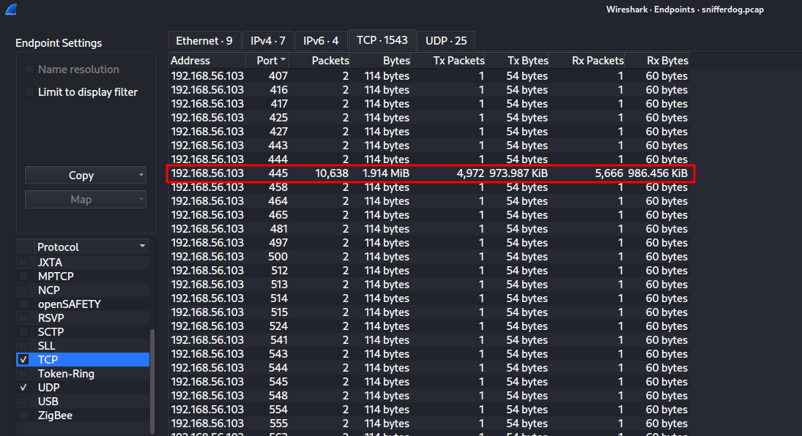

# SnifferDog

Challenges were an introduction to network analysis.

### How many packets in total passed through port 445

> 10638
> 

`Statistics | Endpoint List | TCP`

### What is the 6th disallowed item listed in [http://192.168.56.103:8081/robots.txt](http://192.168.56.103:8081/robots.txt)?

> /installation/
> 

`File | Export | HTTP | 8081 robots`

### What version of Jenkins is running on 192.168.56.103 (Version only)

> 1.647
> 

`tcp.port==9000 → 2181`

### What is the domain SID for 192.168.56.103

> S-1-5-21-2950693484-2233299975-203034155
> 

`tcp.port==139 → 5793,6361`

